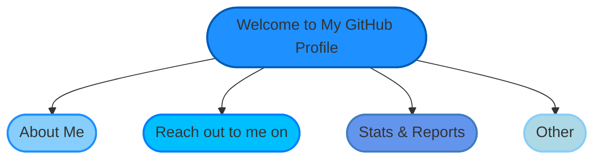

<section align="center">
  
<b>CaoCuong2404's Profile Overview</b>

</section>

## About Me
I'm a software engineer from Vietnam with a passion for crafting beautiful and efficient code. Whether it's building robust applications or exploring new technologies, I'm always eager to learn and collaborate on exciting projects.

- 🗣️ Pronouns: **he/him**
- 💼 Portfolio: <https://portfolio.cuong.day>
- 🔗 Website: <https://cuong.day>
- 💻 Currently contributing to OpenSource repositories and my passion projects

## Reach out to me on
<section align="center">
    

        
        &nbsp;
        
        &nbsp;
        
        &nbsp;
        
        &nbsp;
        
        &nbsp;
        
    

</section>

## Stats
<section align="center">
    <!-- 

        
    
 -->
    

        
        
    

</section>
 
<section align="right">
   
</section>

